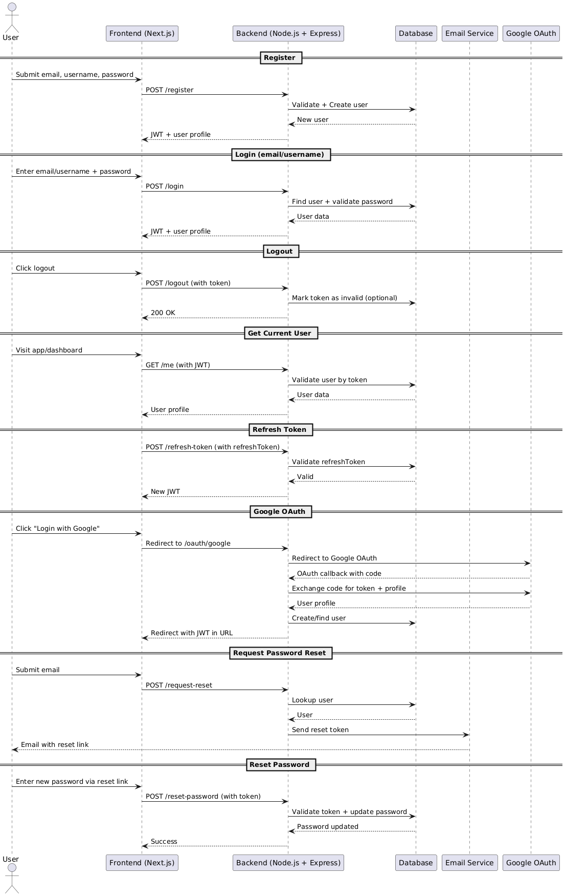

# Authentication API Documentation

## Overview

This is the documentation for the backend for Pixelatia, a live-streaming service.

## Base URL & PORT
 - `Development: http://localhost:5000`
 - `PORT: 5000`

## Authentication Flow

## Use Cases:
  - Register User
  - Login User
  - Logout User
  - Get Current User Profile
  - Refresh Token
  - Googe OAuth
  - Reset password

## Files Related to Auth

#### Controller(s):
  - `auth.controller.js`
  - `Oauth.controller.js`
  - `password.controller.js`